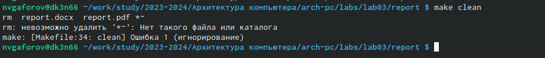

---
## Front matter
title: "Отчёт по лабораторной работе №3"
subtitle: "Дисциплина:архитектура "
author: "Гафоров Нурмухаммад Вомикович "

## Generic otions
lang: ru-RU
toc-title: "Содержание"

## Bibliography
bibliography: bib/cite.bib
csl: pandoc/csl/gost-r-7-0-5-2008-numeric.csl

## Pdf output format
toc: true # Table of contents
toc-depth: 2
lof: true # List of figures
lot: true # List of tables
fontsize: 12pt
linestretch: 1.5
papersize: a4
documentclass: scrreprt
## I18n polyglossia
polyglossia-lang:
  name: russian
  options:
	- spelling=modern
	- babelshorthands=true
polyglossia-otherlangs:
  name: english
## I18n babel
babel-lang: russian
babel-otherlangs: english
## Fonts
mainfont: PT Serif
romanfont: PT Serif
sansfont: PT Sans
monofont: PT Mono
mainfontoptions: Ligatures=TeX
romanfontoptions: Ligatures=TeX
sansfontoptions: Ligatures=TeX,Scale=MatchLowercase
monofontoptions: Scale=MatchLowercase,Scale=0.9
## Biblatex
biblatex: true
biblio-style: "gost-numeric"
biblatexoptions:
  - parentracker=true
  - backend=biber
  - hyperref=auto
  - language=auto
  - autolang=other*
  - citestyle=gost-numeric
## Pandoc-crossref LaTeX customization
figureTitle: "Рис."
tableTitle: "Таблица"
listingTitle: "Листинг"
lofTitle: "Список иллюстраций"
lotTitle: "Список таблиц"
lolTitle: "Листинги"
## Misc options
indent: true
header-includes:
  - \usepackage{indentfirst}
  - \usepackage{float} # keep figures where there are in the text
  - \floatplacement{figure}{H} # keep figures where there are in the text
---

# Цель работы

Целью данной лабораторной работы является
 освоение процедуры оформления отчетов 
 с помощью легковесного языка разметки Markdown 

Преобразовать файл README.md можно следующим образом:
pandoc README.md -o README.pdf

или так
pandoc README.md -o README.docx

FILES = $(patsubst %.md, %.docx, $(wildcard *.md))
FILES += $(patsubst %.md, %.pdf, $(wildcard *.md))

LATEX_FORMAT =

FILTER = --filter pandoc-crossref
%.docx: %.md
-pandoc "$<" $(FILTER) -o "$@"
%.pdf: %.md
-pandoc "$<" $(LATEX_FORMAT) $(FILTER) -o "$@"
all: $(FILES)
@echo $(FILES)
clean:
-rm $(FILES) *~

# Задание

1.Заполнение отчета по выполнению лабораторной работы №4 
с помощью языка разметки Markdown
2.Виполнение задание для самостоятельной работы 

# Теоретическое введение
Markdown - легковесный язык разметки, созданный с целью обозначения 
форматирования в простом тексте, с максимальным сохранением его 
читаемости человеком, и пригодный для машинного преобразования в языки 
для продвинутых публикаций. 
Внутритекстовые формулы делаются аналогично формулам LaTeX.
В Markdown вставить изображение в документ можно с помощью 
непосредственного указания адреса изображения.
Синтаксис Markdown для встроенной ссылки состоит из части [link text], 
представляющей текст гиперссылки, и части (file-name.md) – URL-адреса или 
имени файла, на который дается ссылка.
Markdown поддерживает как встраивание фрагментов кода в предложение, так 
и их размещение между предложениями в виде отдельных огражденных блоков. 
Огражденные блоки кода — это простой способ выделить синтаксис для 
фрагментов кода.

Более подробно об Unix см. в [@gnu-doc:bash;@newham:2005:bash;@zarrelli:2017:bash;@robbins:2013:bash;@tannenbaum:arch-pc:ru;@tannenbaum:modern-os:ru].

# Выполнение лабораторной работы

Открыли терминал (рис. [-@fig:001]).

{#fig:001 width=70%}

Обновляю локальный репозиторий,скачав изменения 
из удаленного репозитория с помощью команды git pull  (рис. [-@fig:002]).

{#fig:002 width=70%}

Перехожу в каталог с шаблоном отчета по лабораторной работе №3 с помощью cd (рис. [-@fig:003]).

{#fig:003 width=70%}

Компилирую шаблон с использованием Makefile,вводя команду make (рис. [-@fig:004]).

{#fig:004 width=70%}

Откроем и проверяем корректность полученных (рис. [-@fig:005]).
{#fig:005 width=70%}

Удаляю полученные файлы с использованием Makefaile,вводя команду make clean (рис. [-@fig:006]).

{#fig:006 width=70%}

Откроем посмотрим что мы удалили (рис. [-@fig:007]).
{#fig:007 width=70%}

Откроем файл report.md с помощью текстового редактора gedit report.md (рис. [-fig:008]).

{#fig:008 width=70%}

Задания 7, 8 лабораторной работы соотвествуют заданиям самостоятельной
так что все последующие действия будут представлены в следующем
разделе.

Задания для самостаятельной работы. 
В соответствующем каталоге создадим отчёт по лабораторной работе N 2 в
формате Markdown. Отчет создадим 3 форматах: pdf, docx и md  (рис. [-@fig:009]).

{#fig:009 width=70%}

файл report.docx мы создали и откроем его (рис. [-@fig:010]).
{#fig:010 width=70%}

# Выводы
В результате выполнения данной лабораторной работы я освоила процедуры 
оформления отчетов с помощью легковесного языка разметки Markdown.

# Список литературы{.unnumbered}

[ЭВМ](https://esystem.rudn.ru/pluginfile.php/1584625/mod_resource/content/
1/%D0%9B%D0%B0%D0%B1%D0%BE%D1%80%D0%B0%D1%82%D0%BE%D1%80%D0%BD%D0%B0%D1%8
F%20%D1%80%D0%B0%D0%B1%D0%BE%D1%82%D0%B0%20%E2%84%964.pdf)

