---
## Front matter
title: "Отчёта по лабораторной работе №5"
subtitle: "Дисциплина:Архитектура компьютера"
author: "Гафоров Нурмухаммад Вомикович"

## Generic otions
lang: ru-RU
toc-title: "Содержание"

## Bibliography
bibliography: bib/cite.bib
csl: pandoc/csl/gost-r-7-0-5-2008-numeric.csl

## Pdf output format
toc: true # Table of contents
toc-depth: 2
lof: true # List of figures
lot: true # List of tables
fontsize: 12pt
linestretch: 1.5
papersize: a4
documentclass: scrreprt
## I18n polyglossia
polyglossia-lang:
  name: russian
  options:
	- spelling=modern
	- babelshorthands=true
polyglossia-otherlangs:
  name: english
## I18n babel
babel-lang: russian
babel-otherlangs: english
## Fonts
mainfont: PT Serif
romanfont: PT Serif
sansfont: PT Sans
monofont: PT Mono
mainfontoptions: Ligatures=TeX
romanfontoptions: Ligatures=TeX
sansfontoptions: Ligatures=TeX,Scale=MatchLowercase
monofontoptions: Scale=MatchLowercase,Scale=0.9
## Biblatex
biblatex: true
biblio-style: "gost-numeric"
biblatexoptions:
  - parentracker=true
  - backend=biber
  - hyperref=auto
  - language=auto
  - autolang=other*
  - citestyle=gost-numeric
## Pandoc-crossref LaTeX customization
figureTitle: "Рис."
tableTitle: "Таблица"
listingTitle: "Листинг"
lofTitle: "Список иллюстраций"
lotTitle: "Список таблиц"
lolTitle: "Листинги"
## Misc options
indent: true
header-includes:
  - \usepackage{indentfirst}
  - \usepackage{float} # keep figures where there are in the text
  - \floatplacement{figure}{H} # keep figures where there are in the text
---

# Цель работы

Целью данной лабораторной работы является приобретение практических навыков работы в Midnight Commander, освоение инструкций языка ассемблера mov и int.


# Задание

 1. Основы работы с mc
 2. Структура программы на языке ассемблера NASM
 3. Подключение внешнего файла
 4. Выполнение заданий для самостоятельной работы


# Теоретическое введение

Midnight Commander (или просто mc) — это программа, которая позволяет просматривать структуру каталогов и выполнять основные операции по управлению файловой системой, т.е. mc является файловым менеджером. Midnight Commander позволяет сделать работу с файлами более удобной и наглядной. Программа на языке ассемблера NASM, как правило, состоит из трёх секций: секция кода программы (SECTION .text), секция инициированных (известных во время компиляции) данных (SECTION .data) и секция неинициализированных данных (тех, под которые во время компиляции только отводится память, а значение присваивается в ходе выполнения программы) (SECTION .bss). Для объявления инициированных данных в секции .data используются директивы DB, DW, DD, DQ и DT, которые резервируют память и указывают, какие значения должны храниться в этой памяти:
 - DB (define byte) — определяет переменную размером в 1 байт;
 - DW (define word) — определяет переменную размеров в 2 байта (слово);
 - DD (define double word) — определяет переменную размером в 4 байта (двойное слово);
 - DQ (define quad word) — определяет переменную размером в 8 байт (учетве- рённое слово);
 - DT (define ten bytes) — определяет переменную размером в 10 байт. Директивы используются для объявления простых переменных и для объявления массивов. Для определения строк принято использовать директиву DB в связи с особенностями хранения данных в оперативной памяти. Инструкция языка ассемблера mov предназначена для дублирования данных источника в приёмнике.
```NASM
mov dst,src
```
Здесь операнд dst — приёмник, а src — источник. В качестве операнда могут выступать регистры (register), ячейки памяти (memory) и непосредственные значения (const). Инструкция языка ассемблера intпредназначена для вызова прерывания с указанным номером.
```NASM
int n
```
Здесь n — номер прерывания, принадлежащий диапазону 0–255. При программировании в Linux с использованием вызовов ядра sys_calls n=80h (принято задавать в шестнадцатеричной системе счисления).


# Выполнение лабораторной работы
##Основы работы с mc

Открываю Midnight Commander, введя в терминал mc (рис. [-@fig:001]).

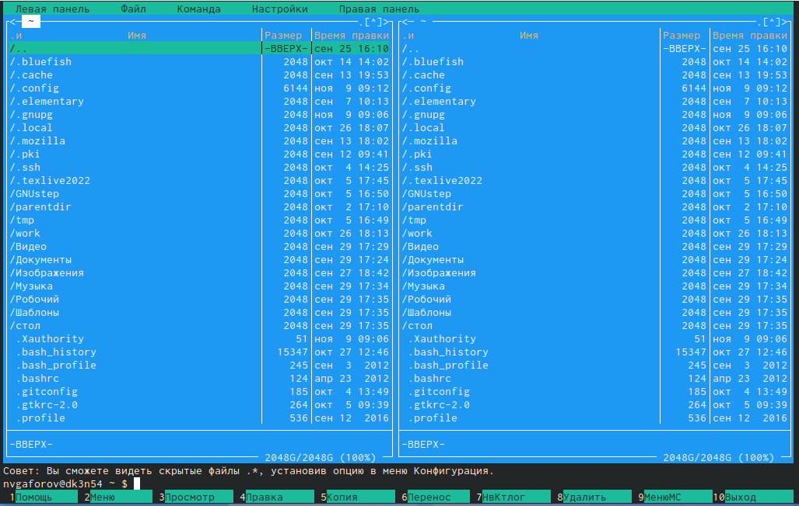{ #fig:001 width=70% }


Перехожу в каталог ~/work/study/2022-2023/Архитектура Компьютера/arch-pc, используя файловый менеджер mc (рис. [-@fig:002])

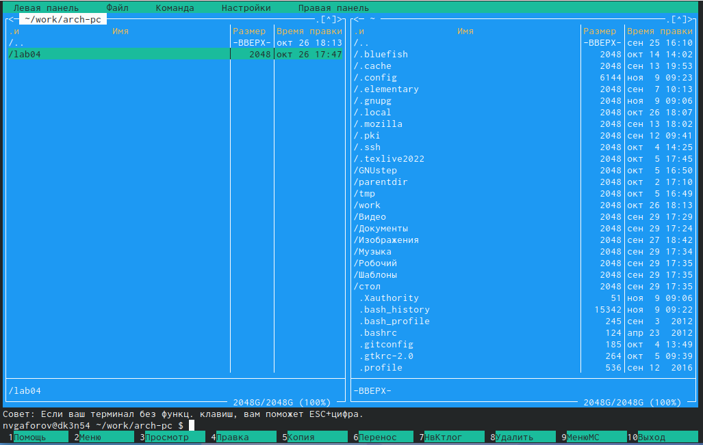{ #fig:002 width=70% }


С помощью функциональной клавиши F7 создаю каталог lab05 (рис. [-@fig:003])


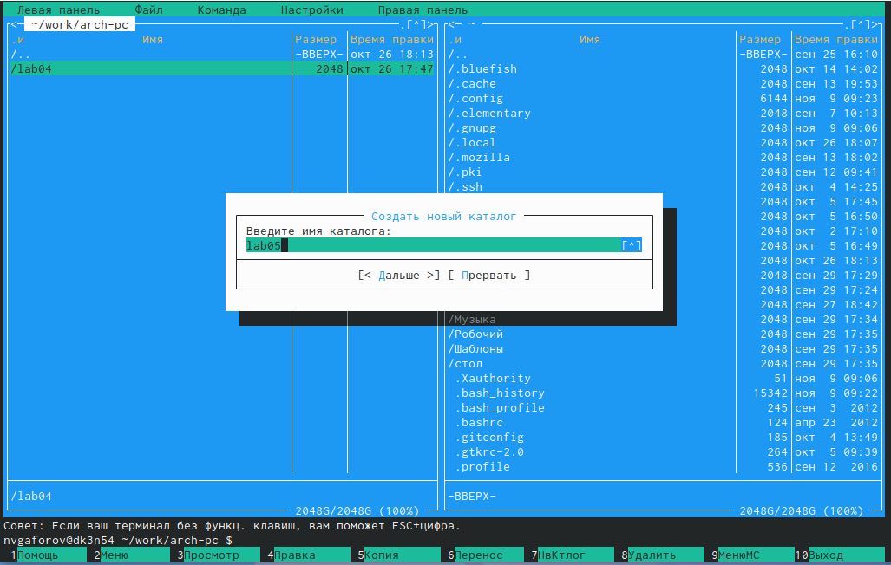{ #fig:003 width=70% }


Переходу в созданный каталог (рис. [-@fig:004]).

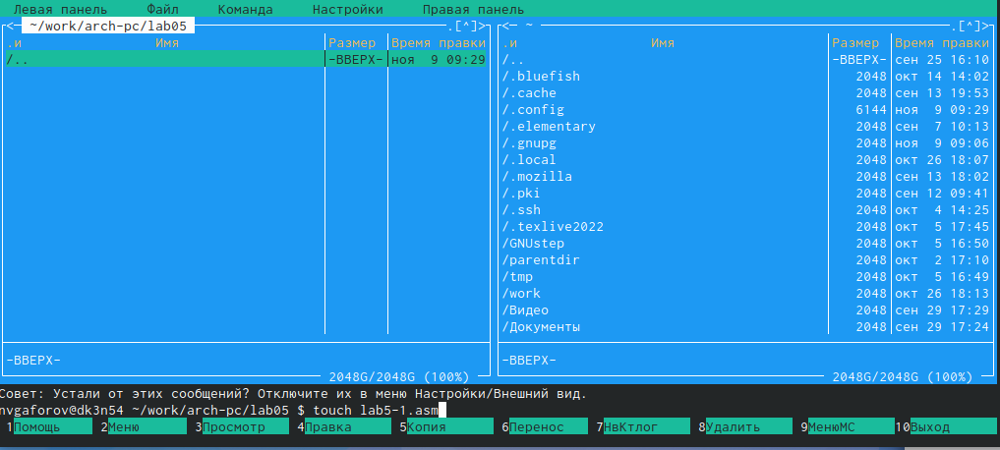{ #fig:004 width=70% }


В строке ввода прописываю команду touch lab5-1.asm, чтобы создать файл, в котором буду работать (рис. [-@fig:005]).

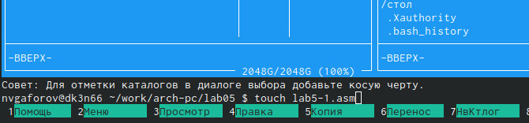{ #fig:005 width=70% }


## Структура программы на языке ассемблера NASM

С помощью функциональной клавиши F4 открываю созданный файл для редактирования в редакторе nano (рис. [-@fig:006]).

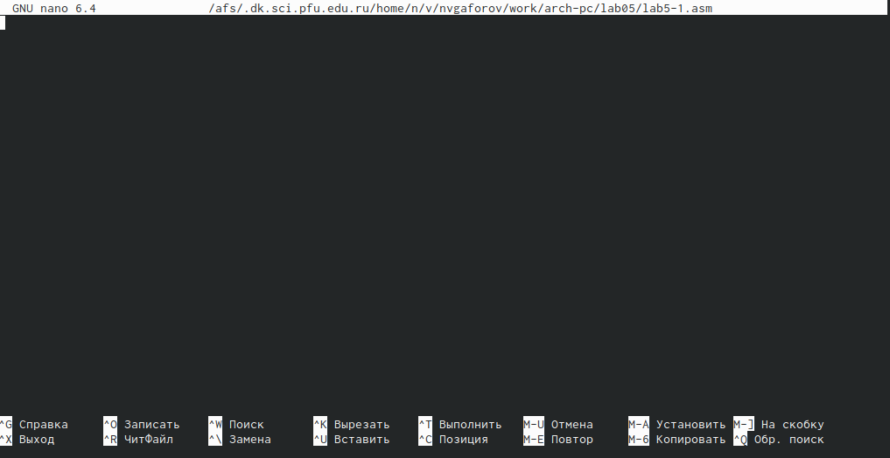{ #fig:006 width=70% }


Ввожу в файл код программы для запроса строки у пользователя (рис. [-@fig:007]). Далее выхожу из файла (Ctrl+X), сохраняя изменения (Y, Enter).

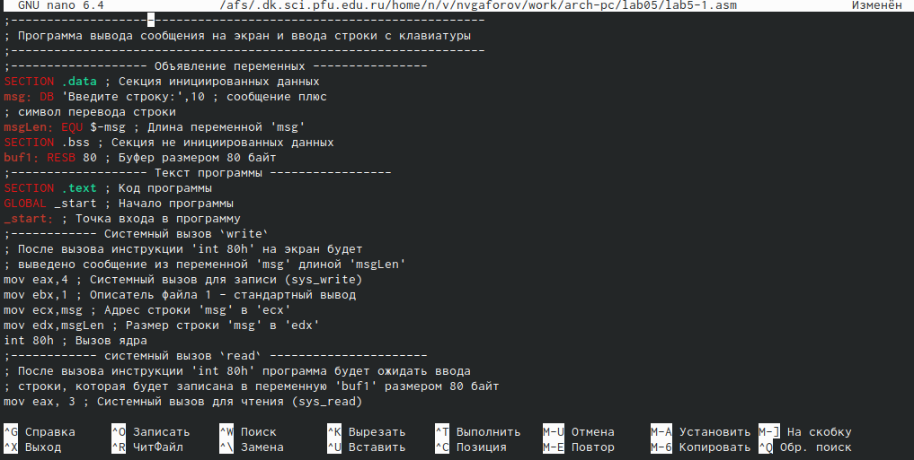{ #fig:007 width=70% }


С помощью функциональной клавиши F3 открываю файл для просмотра, чтобы проверить, содержит ли файл текст программы (рис. [-@fig:008])

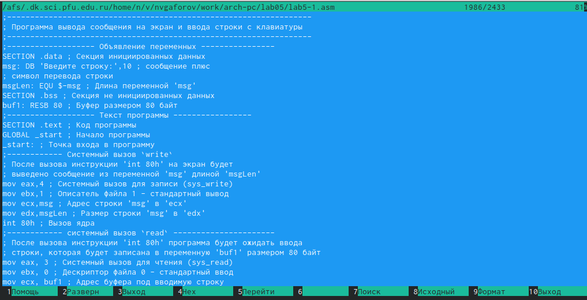{ #fig:008 width=70% }


Транслирую текст программы файла в объектный файл командой nasm -f elf lab5-1.asm. Создался объектный файл lab5-1.o. Выполняю компоновку объектного файла с помощью команды ld -m elf_i386 -o lab5-1 lab5-1.o (рис. [-@fig:009]). Создался исполняемый файл lab5-1

{ #fig:009 width=70% }


Запускаю исполняемый файл. Программа выводит строку "Введите строку: " и ждет ввода с клавиатуры, я ввожу свои ФИО, на этом программа заканчивает свою работу (рис. [-@fig:010]).

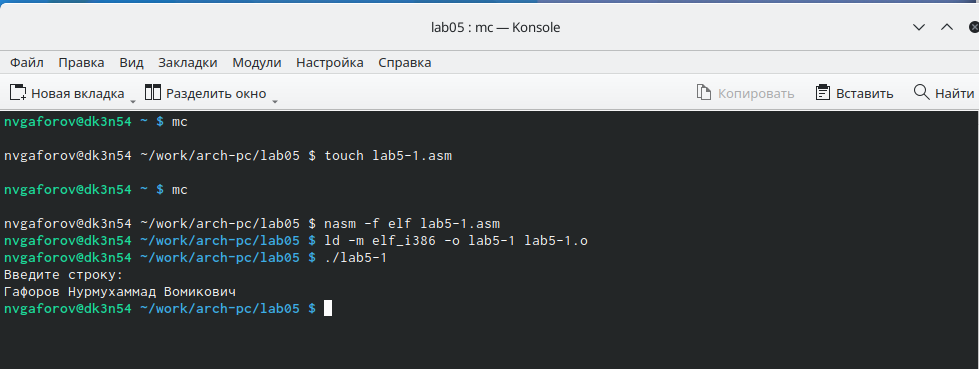{ #fig:010 width=70% }


## Подключение внешнего файла

Скачиваю файл in_out.asm со страницы курса в ТУИС. Он сохранился в каталог "Загрузки".С помощью функциональной клавиши F5 копирую файл in_out.asm из каталога Загрузки в созданный каталог (рис. [-@fig:011]).

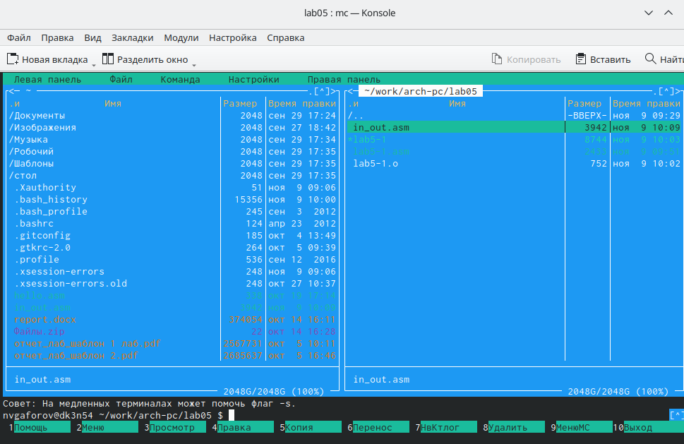{ #fig:011 width=70% }


С помощью функциональной клавиши F5 копирую файл lab5-1 в тот же каталог, но с другим именем, для этого в появившемся окне mc прописываю имя для копии файла (рис. [-@fig:012]).

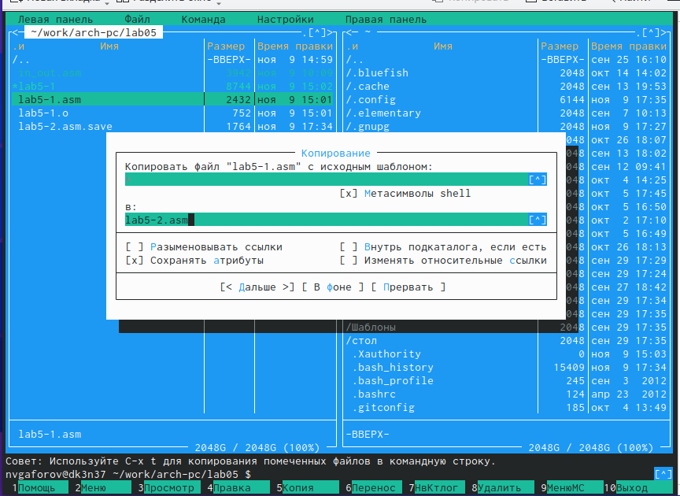{ #fig:012 width=70% }


Изменяю содержимое файла lab5-2.asm во встроенном редакторе nano (рис. [-@fig:013]), чтобы в программе использовались подпрограммы из внешнего файла in_out.asm.

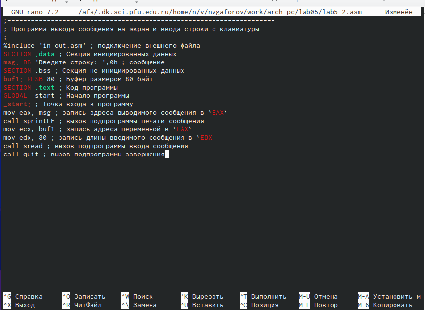{ #fig:013 width=70% }


Транслирую текст программы файла в объектный файл командой nasm -f elf lab5-2.asm. Создался объектный файл lab5-2.o. Выполняю компоновку объектного файла с помощью команды ld -m elf_i386 -o lab5-2 lab6-2.o Создался исполняемый файл lab5-2. Запускаю исполняемый файл (рис. [-@fig:014]). 

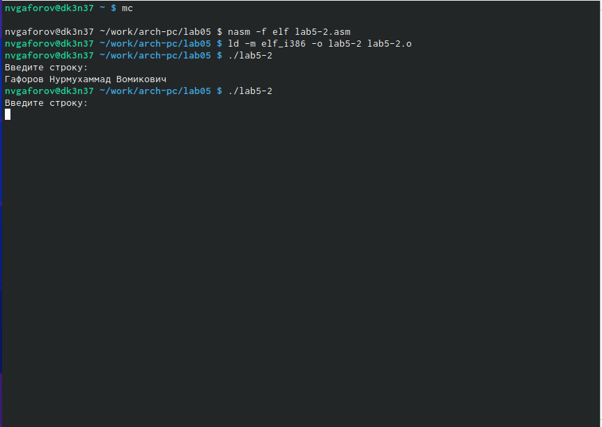{ #fig:014 width=70% }


Открываю файл lab5-2.asm для редактирования в nano функциональной клавишей F4. Изменяю в нем подпрограмму sprintLF на sprint. Сохраняю изменения и открываю файл для просмотра, чтобы проверить сохранение действий (рис. [-@fig:015]).

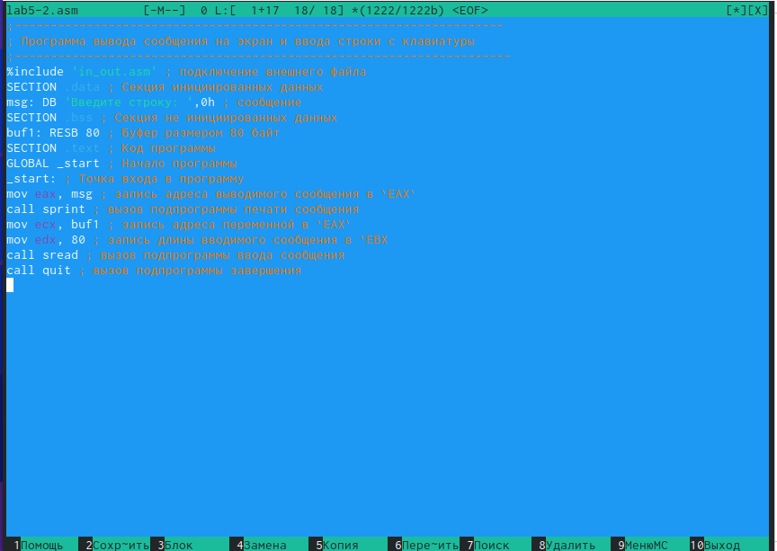{ #fig:015 width=70% }


Снова транслирую файл, выполняю компоновку созданного объектного файла, запускаю новый исполняемый файл (рис. [-@fig:016]).

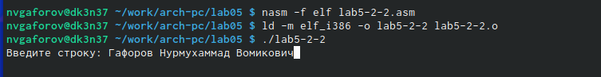{ #fig:016 width=70% }

Разница между первым исполняемым файлом lab5-2 и вторым lab5-2-2 в том, что запуск первого запрашивает ввод с новой строки, а программа, которая исполняется при запуске второго, запрашивает ввод без переноса на новую строку, потому что в этом заключается различие между подпрограммами sprintLF и sprint.


Разница между sprintLF и sprint (рис. [-@fig:017]).

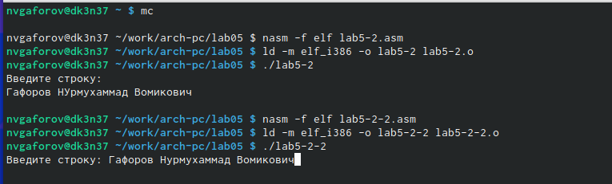{ #fig:017 width=70% }


# Выводы

При выполнении данной лабораторной работы я приобрела практические навыки работы в Midnight Commander, а также освоила инструкции языка ассемблера mov и int.

# Список литературы{.unnumbered}

https://esystem.rudn.ru/pluginfile.php/1584633/mod_resource/content/1/%D0%9B%D0%B0%D0%B1%D0%BE%D1%80%D0%B0%D1%82%D0%BE%D1%80%D0%BD%D0%B0%D1%8F%20%D1%80%D0%B0%D0%B1%D0%BE%D1%82%D0%B0%20%E2%84%966.pdf


