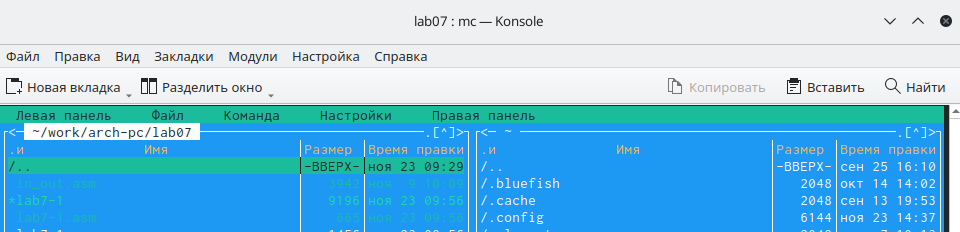

---
## Front matter
title: "Отчёт по лабораторной работе №7"
subtitle: "Дисцеплина:Архитектура компьютера"
author: "Гафоров Нурмухамад Вомикович "

## Generic otions
lang: ru-RU
toc-title: "Содержание"

## Bibliography
bibliography: bib/cite.bib
csl: pandoc/csl/gost-r-7-0-5-2008-numeric.csl

## Pdf output format
toc: true # Table of contents
toc-depth: 2
lof: true # List of figures
lot: true # List of tables
fontsize: 12pt
linestretch: 1.5
papersize: a4
documentclass: scrreprt
## I18n polyglossia
polyglossia-lang:
  name: russian
  options:
	- spelling=modern
	- babelshorthands=true
polyglossia-otherlangs:
  name: english
## I18n babel
babel-lang: russian
babel-otherlangs: english
## Fonts
mainfont: PT Serif
romanfont: PT Serif
sansfont: PT Sans
monofont: PT Mono
mainfontoptions: Ligatures=TeX
romanfontoptions: Ligatures=TeX
sansfontoptions: Ligatures=TeX,Scale=MatchLowercase
monofontoptions: Scale=MatchLowercase,Scale=0.9
## Biblatex
biblatex: true
biblio-style: "gost-numeric"
biblatexoptions:
  - parentracker=true
  - backend=biber
  - hyperref=auto
  - language=auto
  - autolang=other*
  - citestyle=gost-numeric
## Pandoc-crossref LaTeX customization
figureTitle: "Рис."
tableTitle: "Таблица"
listingTitle: "Листинг"
lofTitle: "Список иллюстраций"
lotTitle: "Список таблиц"
lolTitle: "Листинги"
## Misc options
indent: true
header-includes:
  - \usepackage{indentfirst}
  - \usepackage{float} # keep figures where there are in the text
  - \floatplacement{figure}{H} # keep figures where there are in the text
---

# Цель работы

Изучение команд условного и безусловного переходов. Приобретение навыков написания
программ с использованием переходов. Знакомство с назначением и структурой файла
листинга.

# Задание

1. Реализация переходов в NASM
2. Изучение структуры файлы листинга
3. Задание для самостоятельной работы

# Теоретическое введение

Для реализации ветвлений в ассемблере используются так называемые команды передачи
управления или команды перехода. Можно выделить 2 типа переходов:
• условный переход – выполнение или не выполнение перехода в определенную точку
программы в зависимости от проверки условия.
• безусловный переход – выполнение передачи управления в определенную точку про-
граммы без каких-либо условий.

# Выполнение лабораторной работы
##Реализация переходов в NASM

С помощью утилиты mkdir создаю директорию, в которой буду создавать файлы с программами для лабораторной работы №7 (рис. [-@fig:001])

{ #fig:001 width=70% }

Перехожу в созданный каталог с помощью утилиты cd. (рис. [-@fig:002])

{ #fig:002 width=70% }

С помощью утилиты touch создаю файл lab7-1.asm (рис. [-@fig:003])

{ #fig:003 width=70% }

Копирую в текущий каталог файл in_out.asm, т.к. он будет использоваться в других программах (рис. [-@fig:004]).

{ #fig:004 width=70% }

с помошью mc откроем созданний файл lab7-1.asm (рис. [-@fig:005]).

{ #fig:005 width=70% }

Входим в созданний каталог lab7-1.asm (рис. [-@fig:006]).

{ #fig:006 width=70% }

Открываю созданный файл lab7-1.asm, вставляю в него программу вывода значения регистра eax (рис. [-@fig:007]).

{ #fig:007 width=70% }

С помощью функциональной клавиши F3 открываю файл для просмотра, чтобы
проверить, содержит ли файл текст программыОткрытие файла для просмотра (рис. [-@fig:008]).

{#fig:008 width=70%}

Создаю исполняемый файл программы и запускаю его (рис. [-@fig:009]). Вывод программы:Сообщение № 2 Сообщение № 3.

{ #fig:009 width=70% }

Изменяем  текст програми и проверяем его работу как он работает   (рис. [-@fig:010]).

{ #fig:010 width=70% }

Создаю новый исполняемый файл программы и запускаю его (рис. [-@fig:011]). Теперь вывелся   на экран.Сообщение № 2 Сообщение № 1
{ #fig:011 width=70% }

Создаю новый файл lab7-2.asm с помощью утилиты touch (рис. [-@fig:012]).

{ #fig:012 width=70% }

Ввожу в файл текст другойпрограммы для вывода значения регистра  (рис. [-@fig:013]).

{ #fig:013 width=70% }

Создаю и запускаю исполняемый файл lab7-2 (рис. [-@fig:014]). Теперь выводим 50 , на экран показивает Неиболе число 50

{ #fig:014 width=70% }

##Изучение структуры файлы листинга

Обычно nasm создаёт в результате ассемблирования только объектный файл. Получить
файл листинга можно, указав ключ -l и задав имя файла листинга в командной строке.
 (рис. [-@fig:015]).

{ #fig:015 width=70% }

Создайте файл листинга для программы из файла lab7-2.asm  (рис. [-@fig:016]).

{ #fig:016 width=70% }

Откройте файл листинга lab7-2.lst с помощью любого текстового редактора, например
mcedit:(рис. [-@fig:017]).

{ #fig:017 width=70% }

Откройте файл с программой lab7-2.asm и в любой инструкции с двумя операндами
удалить один операнд.(рис. [-@fig:018]).

{ #fig:018 width=70% }

Выполните трансляцию с получением файла листинга (рис. [-@fig:019]).

{ #fig:019 width=70% }

##**Задания для самостоятельная работа**

1. Пишу программу нахождения наименьшей из 3 целочисленных переменных a, b и c.
Значения переменных выбираю из табл. 7.5 в соответствии с вариантом, полученным
при выполнении лабораторной работы № 7. Мой вариант под номером 5, поэтому мои значения - 54, 62 и 87. (рис. [-@fig:020]).

{ #fig:020 width=70% }

Создаю исполняемый файл и проверяю его работу, подставляя необходимые значение.(рис. [-@fig:021]).

{ #fig:021 width=70% }

Программа работает 

Код Программа:

%include 'in_out.asm'
section .data
msg db "Наименьшее число: ",0h
A dd '54'
B dd '62'
C dd '87'
section .bss
min resb 10
section .text
global _start
_start:
; ---------- Записываем 'A' в переменную 'min'
mov ecx,[A] ; 'ecx = A'
mov [min],ecx ; 'min = A'
; ---------- Сравниваем 'A' и 'С' (как символы)
cmp ecx,[C] ; Сравниваем 'A' и 'С'
jg check_B
mov ecx,[C] ; иначе 'ecx = C'
mov [min],ecx ; 'min = C'
; ---------- Преобразование 'min(A,C)' из символа в число
check_B:
mov eax,min
call atoi ; Вызов подпрограммы перевода символа в число
mov [min],eax ; запись преобразованного числа в min
; ---------- Сравниваем 'min(A,C)' и 'B' (как числа)
mov ecx,[min]
cmp ecx,[B] ; Сравниваем 'min(A,C)' и 'B'
jl fin ; если 'min(A,C)<B', то переход на 'fin',
mov ecx,[B] ; иначе 'ecx = B'
mov [min],ecx
; ---------- Вывод результата
fin:
mov eax, msg
call sprint ; Вывод сообщения 'Наименьшее число: '
mov eax,[min]
call iprintLF ; Вывод 'min(A,B,C)'
call quit ; Выход

2 .Пишу программу, которая для введенных с клавиатуры значений х и а вычисляет значение и выводит результат вычислений заданной для моего варианта функции f(x): (рис. [-@fig:022]).

{ #fig:022 width=70% }

Создаю исполняемый файл и проверяю его работу для значений х и а соответственно: (3;0), (1;2)
(рис. [-@fig:023]).

{ #fig:023 width=70% }

# Вывод

По итогам данной лабораторной работы я изучила команды условного и безусловного переходов, приобрела навыки написания программ с использованием переходов и ознакомилась с назначением и структурой файла листинга, что поможет мне при выполнении последующих лабораторных работ.

# Список литературы{.unnumbered}

1. GDB: The GNU Project Debugger. — URL: https://www.gnu.org/software/gdb/.
2. GNU Bash Manual. — 2016. — URL: https://www.gnu.org/software/bash/manual/.
3. Midnight Commander Development Center. — 2021. — URL: https://midnight-commander.
org/.
4. NASM Assembly Language Tutorials. — 2021. — URL: https://asmtutor.com/.
5. Newham C. Learning the bash Shell: Unix Shell Programming. — O’Reilly Media, 2005. —
354 с. — (In a Nutshell). — ISBN 0596009658. — URL: http://www.amazon.com/Learning-
bash-Shell-Programming-Nutshell/dp/0596009658.
6. Robbins A. Bash Pocket Reference. — O’Reilly Media, 2016. — 156 с. — ISBN 978-1491941591.
7. The NASM documentation. — 2021. — URL: https://www.nasm.us/docs.php.
8. Zarrelli G. Mastering Bash. — Packt Publishing, 2017. — 502 с. — ISBN 9781784396879.
9. Колдаев В. Д., Лупин С. А. Архитектура ЭВМ. — М. : Форум, 2018.
10. Куляс О. Л., Никитин К. А. Курс программирования на ASSEMBLER. — М. : Солон-Пресс,
2017.
11. Новожилов О. П. Архитектура ЭВМ и систем. — М. : Юрайт, 2016.
12. Расширенный ассемблер: NASM. — 2021. — URL: https://www.opennet.ru/docs/RUS/nasm/.
13. Робачевский А., Немнюгин С., Стесик О. Операционная система UNIX. — 2-е изд. — БХВ-
Петербург, 2010. — 656 с. — ISBN 978-5-94157-538-1.
14. Столяров А. Программирование на языке ассемблера NASM для ОС Unix. — 2-е изд. —
М. : МАКС Пресс, 2011. — URL: http://www.stolyarov.info/books/asm_unix.
15. Таненбаум Э. Архитектура компьютера. — 6-е изд. — СПб. : Питер, 2013. — 874 с. —
(Классика Computer Science).
16. Таненбаум Э., Бос Х. Современные операционные системы. — 4-е изд. — СПб. : Питер,
2015. — 1120 с. — (Классика Computer Science).
