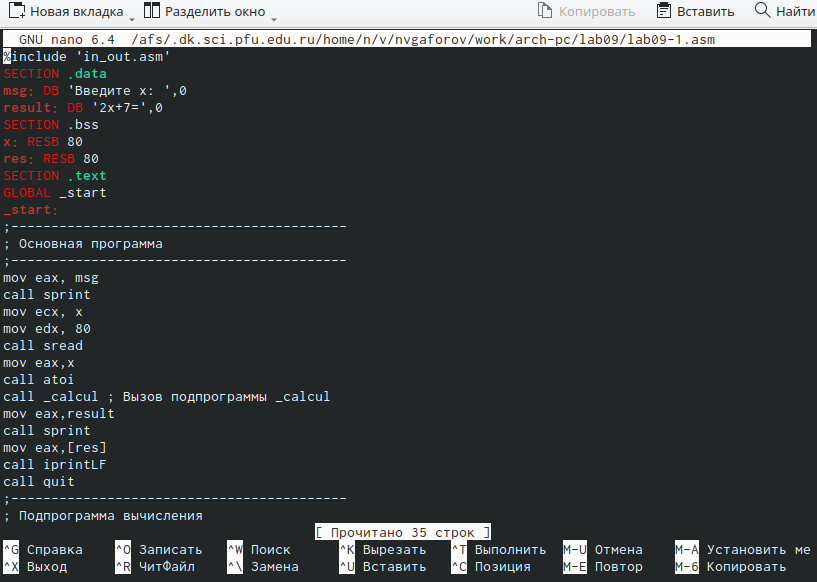
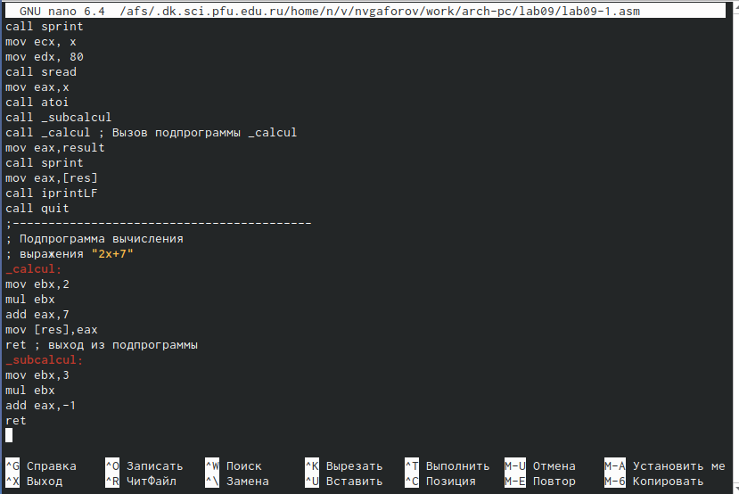
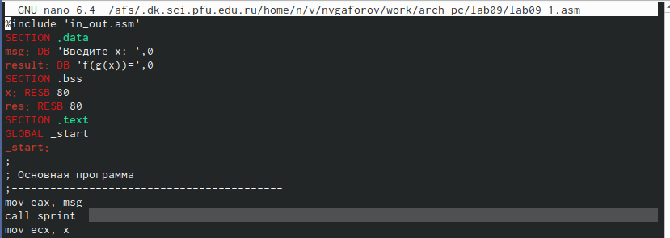

---
## Front matter
title: "Отчёт по лабораторной работе №9"
subtitle: "Дисциплина: архитектура компьютеров"
author: "Гафоров Нурмухаммад Вомикович "

## Generic otions
lang: ru-RU
toc-title: "Содержание"

## Bibliography
bibliography: bib/cite.bib
csl: pandoc/csl/gost-r-7-0-5-2008-numeric.csl

## Pdf output format
toc: true # Table of contents
toc-depth: 2
lof: true # List of figures
lot: true # List of tables
fontsize: 12pt
linestretch: 1.5
papersize: a4
documentclass: scrreprt
## I18n polyglossia
polyglossia-lang:
  name: russian
  options:
	- spelling=modern
	- babelshorthands=true
polyglossia-otherlangs:
  name: english
## I18n babel
babel-lang: russian
babel-otherlangs: english
## Fonts
mainfont: PT Serif
romanfont: PT Serif
sansfont: PT Sans
monofont: PT Mono
mainfontoptions: Ligatures=TeX
romanfontoptions: Ligatures=TeX
sansfontoptions: Ligatures=TeX,Scale=MatchLowercase
monofontoptions: Scale=MatchLowercase,Scale=0.9
## Biblatex
biblatex: true
biblio-style: "gost-numeric"
biblatexoptions:
  - parentracker=true
  - backend=biber
  - hyperref=auto
  - language=auto
  - autolang=other*
  - citestyle=gost-numeric
## Pandoc-crossref LaTeX customization
figureTitle: "Рис."
tableTitle: "Таблица"
listingTitle: "Листинг"
lofTitle: "Список иллюстраций"
lotTitle: "Список таблиц"
lolTitle: "Листинги"
## Misc options
indent: true
header-includes:
  - \usepackage{indentfirst}
  - \usepackage{float} # keep figures where there are in the text
  - \floatplacement{figure}{H} # keep figures where there are in the text
---

# Цель работы

Приобретение навыков написания программ с использованием подпрограмм. Знакомство с методами отладки при помощи GDB и его основными возможностями.

# Задание

   1. Реализация подпрограмм в NASM.

   2. Отладка программам с помощью GDB.

   3. Добавление точек останова.

   4. Работа с данными программы в GDB.

   5. Обработка аргументов командной строки в GDB.

   6. Задания для самостоятельной работы.

# Теоретическое введение

Отладка — это процесс поиска и исправления ошибок в программе. Отладчики позволяют управлять ходом выполнения программы, контролировать и изменять данные. Это помогает быстрее найти место ошибки в программе и ускорить её исправление. Наиболее популярные способы работы с отладчиком — это использование точек останова и выполнение программы по шагам.

GDB (GNU Debugger — отладчик проекта GNU) работает на многих UNIX-подобных системах и умеет производить отладку многих языков программирования. GDB предлагает обширные средства для слежения и контроля за выполнением компьютерных программ. Отладчик не содержит собственного графического пользовательского интерфейса и использует стандартный текстовый интерфейс консоли. Однако для GDB существует несколько сторонних графических надстроек, а кроме того, некоторые интегрированные среды разработки используют его в качестве базовой подсистемы отладки.

Отладчик GDB (как и любой другой отладчик) позволяет увидеть, что происходит «внутри» программы в момент её выполнения или что делает программа в момент сбоя.

Команда run (сокращённо r) — запускает отлаживаемую программу в оболочке GDB.

Команда kill (сокращённо k) прекращает отладку программы, после чего следует вопрос о прекращении процесса отладки. Если в ответ введено y (то есть «да»), отладка программы прекращается. Командой run её можно начать заново, при этом все точки останова (breakpoints), точки просмотра (watchpoints) и точки отлова (catchpoints) сохраняются.

Для выхода из отладчика используется команда quit (или сокращённо q).

Если есть файл с исходным текстом программы, а в исполняемый файл включена информация о номерах строк исходного кода, то программу можно отлаживать, работая в отладчике непосредственно с её исходным текстом. Чтобы программу можно было отлаживать на уровне строк исходного кода, она должна быть откомпилирована с ключом -g.

Установить точку останова можно командой break (кратко b). Типичный аргумент этой команды — место установки. Его можно задать как имя метки или как адрес. Чтобы не было путаницы с номерами, перед адресом ставится «звёздочка».

Информацию о всех установленных точках останова можно вывести командой info (кратко i).

Для того чтобы сделать неактивной какую-нибудь ненужную точку останова, можно воспользоваться командой disable.

Обратно точка останова активируется командой enable.

Если же точка останова в дальнейшем больше не нужна, она может быть удалена с помощью команды delete.

Для продолжения остановленной программы используется команда continue (c). Выполнение программы будет происходить до следующей точки останова. В качестве аргумента может использоваться целое число N, которое указывает отладчику проигнорировать N − 1 точку останова (выполнение остановится на N-й точке).

Команда stepi (кратко sI) позволяет выполнять программу по шагам, т.е. данная команда выполняет ровно одну инструкцию.

Подпрограмма — это, как правило, функционально законченный участок кода, который можно многократно вызывать из разных мест программы. В отличие от простых переходов из подпрограмм существует возврат на команду, следующую за вызовом. Если в программе встречается одинаковый участок кода, его можно оформить в виде подпрограммы, а во всех нужных местах поставить её вызов. При этом подпрограмма будет содержаться в коде в одном экземпляре, что позволит уменьшить размер кода всей программы.

Для вызова подпрограммы из основной программы используется инструкция call, которая заносит адрес следующей инструкции в стек и загружает в регистр eip адрес соответствующей подпрограммы, осуществляя таким образом переход. Затем начинается выполнение подпрограммы, которая, в свою очередь, также может содержать подпрограммы. Подпрограмма завершается инструкцией ret, которая извлекает из стека адрес, занесённый туда соответствующей инструкцией call, и заносит его в eip. После этого выполнение основной программы возобновится с инструкции, следующей за инструкцией call.

# Выполнение лабораторной работы

## **Реализация подпрограмм в NASM**Видим, что в выводе мы получаем неправильный ответ.

Создаю каталог для выполнения лабораторной работы № 9, перехожу в него и создаю файл lab09-1.asm. (рис. [-@fig:001]).

{#fig:001 width=70%}

Ввожу в файл lab09-1.asm текст программы с использованием подпрограммы из листинга 9.1. (рис. [-@fig:002]).

{#fig:002 width=70%}

Создаю исполняемый файл и проверяю его работу. (рис. [-@fig:003]).

{#fig:003 width=70%}

Изменяю текст программы, добавив подпрограмму _subcalcul в подпрограмму _calcul
для вычисления выражения f(g(x)), где x вводится с клавиатуры, f(x) = 2x + 7, g(x) =
3x − 1. (рис. [-@fig:004]).

{#fig:004 width=70%}

Изменение текст 2 фото (рис. [-@fig:005]).

{#fig:005 width=70%}

Создаю исполняемый файл и проверяю его работу.(рис. [-@fig:006]).

{#fig:006 width=70%}

## **Отладка программам с помощью GDB**

Создаю файл lab09-2.asm и поставим программы из Листинга 9.2 (рис. [-@fig:007]).

{#fig:007 width=70%}

Получаю исполняемый файл для работы с GDB с ключом ‘-g’. (рис. [-@fig:008]).

{#fig:008 width=70%}

Загружаю исполняемый файл в отладчик gdb (рис. -[@fig:009]).

{#fig:009 width=70%}

Проверяю работу программы, запустив ее в оболочке GDB с помощью команды run. (рис. [-@fig:010]).

{#fig:010 width=70%}

Для более подробного анализа программы устанавливаю брейкпоинт на метку _start и запускаю её (рис.[-@fig:011]).

{#fig:011 width=70%}

Просматриваю дисассимилированный код программы с помощью команды disassemble, начиная с метки _start, и переключаюсь на отображение команд с синтаксисом Intel, введя команду set disassembly-flavor intel. (рис. [-@fig:012]).

{#fig:012 width=70%}

В режиме ATT имена регистров начинаются с символа %, а имена операндов с $, в то время как в Intel используется привычный нам синтаксис. (рис. [-@fig:013]).

Включаю режим псевдографики для более удобного анализа программы с помощью команд layout asm и layout regs.Видим, что в выводе мы получаем неправильный ответ.

{#fig:013 width=70%}

### **Добавление точек останова**

Проверяю, что точка останова по имени метки _start установлена с помощью команды info breakpoints и устанавливаю еще одну точку останова по адресу инструкции mov ebx,0x0. Просматриваю информацию о всех установленных точках останова. (рис. [-@fig:014]).

{#fig:014 width=70%}

##Работа с данными программы в GDB

Выполняю 5 инструкций с помощью команды stepi и слежу за изменением значений регистров. (рис. [-@fig:015]).

{#fig:015 width=70%}

(рис. [-@fig:016]).

{#fig:016 width=70%}

(рис. [-@fig:017]).

{#fig:017 width=70%}

([-рис. @fig:018]).

{#fig:018 width=70%}

(рис. [-@fig:019]).

{#fig:019 width=70%}

(рис. [-@fig:020]).

{#fig:020 width=70%}

Изменились значения регистров eax, ecx, edx и ebx.

Просматриваю значение переменной msg1 по имени с помощью команды x/1sb &msg1 и значение переменной msg2 по ее адресу. (рис. [-@fig:021]).

{#fig:021 width=70%}

С помощью команды set изменяю первый символ переменной msg1 и заменяю пВидим, что в выводе мы получаем неправильный ответ.ервый символ в переменной msg2. (рис. [-@fig:022]).

{#fig:022 width=70%}

Вывожу в шестнадцатеричном формате, в двоичном формате и в символьном виде соответственно значение регистра edx с помощью команды print p/F $val./  (рис. [-@fig:023]).

С помощью команды set изменяю значение регистра ebx в соответствии с заданием.

Разница вывода команд p/s $ebx отличается тем, что в первом случае мы переводим символ в его строковый вид, а во втором случае число в строковом виде не изменяется.

{#fig:023 width=70%}

Завершаю выполнение программы с помощью команды continue и выхожу из GDB с помощью команды quit. (рис. [-@fig:024]).

{#fig:024 width=70%}

### **Обработка аргументов командной строки в GDB**

Копирую файл lab8-2.asm с программой из листинга 8.2 в файл с именем lab09-3.asm и создаю исполняемый файл. (рис. [-@fig:025]).

{#fig:025 width=70%}

Загружаю исполняемый файл в отладчик gdb, указывая необходимые аргументы с использованием ключа --args. (рис. [-@fig:026]).

{#fig:026 width=70%}

Устанавливаю точку останова перед первой инструкцией в программе и запускаю ее. ([-рис. @fig:027]).

{#fig:027 width=70%}

Посматриваю вершину стека и позиции стека по их адресам. (рис. [-@fig:028]).

{#fig:028 width=70%}

## **Задания для самостоятельной работы**

1. Создаем файл lab09-4.asm .Преобразовываю программу из лабораторной работы №8 (Задание №1 для самостоятельной работы), реализовав вычисление значения функции f(x) как подпрограмму. (рис. [-@fig:029]).

{#fig:029 width=70%}

Запускаю код и проверяю, что она работает корректно.  (рис. [-@fig:030]).

{#fig:030 width=70%}

Код программы:

%include 'in_out.asm'Видим, что в выводе мы получаем неправильный ответ.

SECTION .data

msg db "Результат: ",0

SECTION .text

global _start

_start:

pop ecx

pop edx

sub ecx,1

mov esi, 0

mov edi,3

call .next

.next:

pop eax

call atoi

add eax,10

mul edi

add esi,eax

cmp ecx,0h

jz .done

loop .next

.done:

mov eax, msg

call sprint

mov eax, esi

call iprintLF

call quit

ret

2. Ввожу в файл task1.asm текст программы из листинга 9.3. (рис. [-@fig:031]).

{#fig:031 width=70%}

При корректной работе программы должно выводится "25". Создаю исполняемый файл и запускаю его. (рис. [-@fig:032]).

{#fig:032 width=70%}

Видим, что в выводе мы получаем неправильный ответ.

Получаю исполняемый файл для работы с GDB, запускаю его и ставлю брейкпоинты для каждой инструкции, связанной с вычислениями. С помощью команды continue прохожусь по каждому брейкпоинту и слежу за изменениями значений регистров.

При выполнении инструкции mul ecx происходит умножение ecx на eаx, то есть 4 на 2, вместо умножения 4 на 5 (регистр ebx). Происходит это из-за того, что стоящая перед mov ecx,4 инструкция add ebx,eax не связана с mul ecx, но связана инструкция mov eax,2 (рис. [-@fig:033]).

{#fig:033 width=70%}

Исправляем ошибку, добавляя после add ebx,eax mov eax,ebx и заменяя ebx на eax в инструкциях add ebx,5 и mov edi,ebx.  (рис. [-@fig:034]).

{#fig:034 width=70%}

Создаем исполняемый файл и запускаем его. Убеждаемся, что ошибка исправлена (рис. [-@fig:035]).

{#fig:035 width=70%}

код программи 

%include 'in_out.asm'
SECTION .data
div: DB 'Результат: ',0
SECTION .text
GLOBAL _start
_start:
; ---- Вычисление выражения (3+2)*4+5
mov ebx,3
mov eax,2
add ebx,eax
mov ecx,4
mul ecx
add ebx,5
mov edi,ebx
; ---- Вывод результата на экран
mov eax,div
call sprint
mov eax,edi
call iprintLF
call quit

# Выводы

Во время выполнения данной лабораторной работы я приобрела навыки написания программ с использованием подпрограмм и ознакомилась с методами отладки при помощи GDB и его основными возможностями.

# Список литературы{.unnumbered}

1. GDB: The GNU Project Debugger. — URL: https://www.gnu.org/software/gdb/.
2. GNU Bash Manual. — 2016. — URL: https://www.gnu.org/software/bash/manual/.
3. Midnight Commander Development Center. — 2021. — URL: https://midnight-commander.
org/.
4. NASM Assembly Language Tutorials. — 2021. — URL: https://asmtutor.com/.
5. Newham C. Learning the bash Shell: Unix Shell Programming. — O’Reilly Media, 2005. —
354 с. — (In a Nutshell). — ISBN 0596009658. — URL: http://www.amazon.com/Learning-
bash-Shell-Programming-Nutshell/dp/0596009658.
6. Robbins A. Bash Pocket Reference. — O’Reilly Media, 2016. — 156 с. — ISBN 978-1491941591.
7. The NASM documentation. — 2021. — URL: https://www.nasm.us/docs.php.
8. Zarrelli G. Mastering Bash. — Packt Publishing, 2017. — 502 с. — ISBN 9781784396879.
9. Колдаев В. Д., Лупин С. А. Архитектура ЭВМ. — М. : Форум, 2018.
10. Куляс О. Л., Никитин К. А. Курс программирования на ASSEMBLER. — М. : Солон-Пресс,
2017.
11. Новожилов О. П. Архитектура ЭВМ и систем. — М. : Юрайт, 2016.
12. Расширенный ассемблер: NASM. — 2021. — URL: https://www.opennet.ru/docs/RUS/nasm/.
13. Робачевский А., Немнюгин С., Стесик О. Операционная система UNIX. — 2-е изд. — БХВ-
Петербург, 2010. — 656 с. — ISBN 978-5-94157-538-1.
14. Столяров А. Программирование на языке ассемблера NASM для ОС Unix. — 2-е изд. —
М. : МАКС Пресс, 2011. — URL: http://www.stolyarov.info/books/asm_unix.
15. Таненбаум Э. Архитектура компьютера. — 6-е изд. — СПб. : Питер, 2013. — 874 с. —
(Классика Computer Science).
16. Таненбаум Э., Бос Х. Современные операционные системы. — 4-е изд. — СПб. : Питер,
2015. — 1120 с. — (Классика Computer Science)
